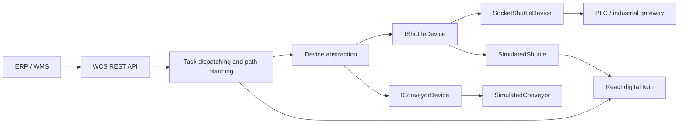

# Industrial AS/RS Warehouse Control System


[](https://github.com/lekhoa1509/industrial-asrs-wcs/actions/workflows/ci.yml)
[](https://dotnet.microsoft.com/)
[](https://react.dev/)

A hardware-independent Warehouse Control System for a multi-zone shuttle AS/RS. It demonstrates task dispatching, shortest-path planning, deadlock-safe resource reservation, real device integration, deterministic simulation, and a live 2D digital twin.

## Run It In Two Commands

```bash
git clone https://github.com/lekhoa1509/industrial-asrs-wcs.git
cd industrial-asrs-wcs
docker compose up --build
```

Open **http://127.0.0.1:3000**, press **Create order**, and watch the WCS select a shuttle, highlight the route, and execute the movement. No PLC hardware is required.

### Windows note: `localhost` does not connect

No additional project setup is required. On some Windows, Edge, VPN, proxy, or Docker Desktop configurations, `localhost` may resolve through IPv6 while Docker Desktop exposes the published port through IPv4. Use these addresses instead:

```text
Dashboard: http://127.0.0.1:3000
API:       http://127.0.0.1:8080/health
```

You can verify the containers and ports with:

```powershell
docker compose ps
curl.exe http://127.0.0.1:8080/health
```

If `localhost` works on another machine, both forms are valid; `127.0.0.1` is documented because it is more predictable on Docker Desktop for Windows.

## The Problem

In a multi-zone automated storage and retrieval system, ERP/WMS creates material movement orders while the WCS must decide how physical devices execute them safely:

- choose an eligible shuttle with minimum empty travel;
- calculate a route between source and destination locations;
- coordinate shared zones so shuttles cannot deadlock;
- tolerate device latency, disconnections, and faults;
- allow software development when PLC hardware is unavailable.

The central design goal is that **domain and dispatching logic do not know whether a device is real or simulated**.

## Architecture



```text
ERP / WMS
    -> WCS API
    -> Dispatching + shortest path
    -> IShuttleDevice / IConveyorDevice
    -> PLC gateway OR simulator
    -> Live visualization
```

## What The Demo Shows

- 12-rail warehouse map: Rail 1–5 in Zone A, Rail 6 as the charging corridor, and Rail 7–12 in Zone B
- two independently moving shuttles
- live shuttle position and device state
- active shortest path highlighted on the grid
- task queue and event stream
- random simulated drive faults and recovery
- a socket-based production adapter using line-delimited JSON

## Device Abstraction

```csharp
public interface IShuttleDevice : IAutomationDevice
{
    Task MoveAsync(
        string orderId,
        IReadOnlyList<Position> path,
        CancellationToken cancellationToken = default);
}
```

`SocketShuttleDevice` represents a real integration boundary. It connects to a PLC/device gateway over TCP, sends JSON commands, and reads telemetry snapshots.

`SimulatedShuttle` uses the same interface but moves through route steps over time. It supports configurable latency, `TimeProvider`, seeded randomness, injected drive faults, and explicit reset behavior.

## Design Decisions And Trade-offs

### Nearest-shuttle dispatching

The dispatcher selects the nearest idle shuttle to the pickup position using rail-and-level travel distance. Cross-zone movements naturally pass Rail 6, the shared charging and transfer corridor.

**Why:** predictable O(n) selection, easy to explain, and appropriate for a small shuttle fleet.

**Trade-off:** greedy selection minimizes the current pickup cost, not the global cost of the entire order queue. A production scheduler could add battery state, load, maintenance priority, and look-ahead optimization.

### Shortest-path planning

The topology planner produces deterministic routes through rail and block-level coordinates. A shuttle leaves its storage rail, moves along the pink main corridor, crosses Rail 6 when necessary, and enters the destination rail. The visualization consumes the same path used by the device.

**Why:** domain behavior is visible and testable without PLC hardware.

**Trade-off:** the current topology is intentionally compact. A real warehouse could replace it with A*, Dijkstra, or a time-expanded graph without changing device contracts.

### Deadlock prevention

The WCS reserves the destination zone before issuing movement. Reservations are always released in a `finally` block.

**Why:** coarse ordered resources remove circular wait and make safety behavior deterministic.

**Trade-off:** zone-level locking reduces concurrency. Segment-level reservations would improve throughput but require collision prediction and reservation ordering.

### Simulator as a first-class component

The simulator is not a UI mock. It implements the same production device interface and models movement delay, telemetry, random faults, and recovery.

**Why:** reviewers can run the system in ten minutes, developers can work without a PLC, and fault scenarios become reproducible.

**Trade-off:** simulated timing cannot validate electrical behavior or PLC scan-cycle edge cases. Hardware-in-the-loop testing remains necessary before commissioning.

## Repository Structure

```text
src/
  Industrial.Asrs.Domain/          Domain model, interfaces, WCS, path planner
  Industrial.Asrs.Infrastructure/  Simulator and real socket device adapter
  Industrial.Asrs.Api/             ASP.NET Core REST API
  industrial-asrs-web/             React 2D digital twin
tests/
  Industrial.Asrs.Tests/           Dispatching and path-planning tests
docker-compose.yml                 One-command local environment
```

## Local Development

Backend:

```bash
dotnet restore Industrial.Asrs.Wcs.sln
dotnet run --project src/Industrial.Asrs.Api
```

Frontend:

```bash
cd src/industrial-asrs-web
npm install
npm run dev
```

Tests:

```bash
dotnet test Industrial.Asrs.Wcs.sln
```

## Production Evolution

- OPC UA adapter with subscriptions and reconnect policies
- graph-based collision-free route planning
- persistent order/event storage
- WebSocket or SignalR telemetry streaming
- OpenTelemetry traces and Prometheus metrics
- hardware-in-the-loop PLC test environment

## Before Publishing

1. Record the running dashboard and save it as `docs/assets/asrs-demo.gif`.
2. Verify the Docker quick start on a clean machine.

## Author

**Khoa** — .NET / industrial automation engineer focused on WCS, PLC integration, asynchronous systems, and digital twins.

## License

This project is released under the [MIT License](LICENSE).
